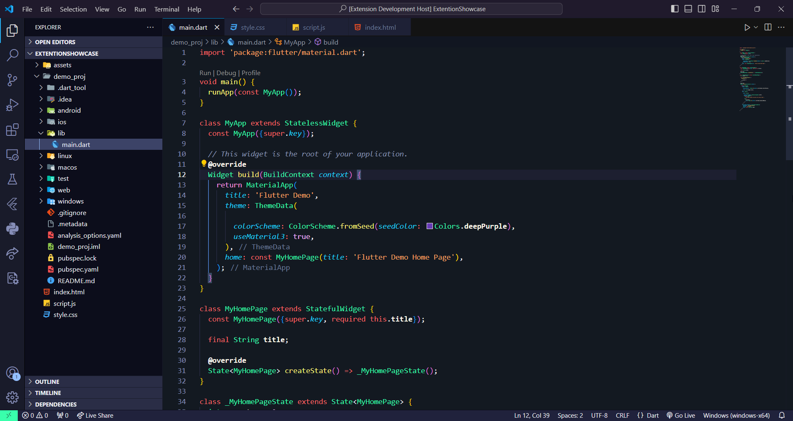
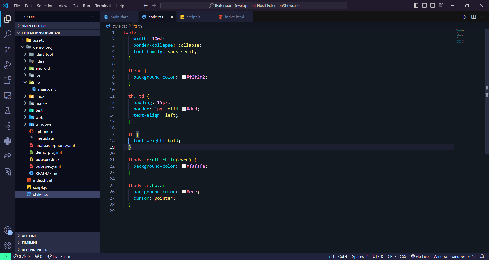
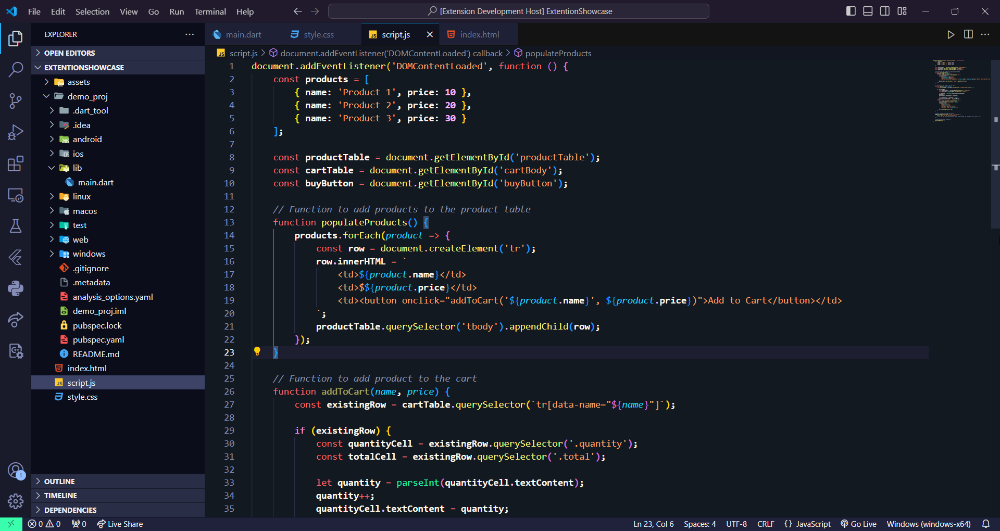

# Neondarkk Piece1

Introducing NeondarKK: A Vibrant Dark Theme for VS Code

### Flutter

### HTML

### CSS

### Javascript

### C++

### C#

### Javas

### Python

UI
--

NeondarKK is my brand new dark theme for VS Code, designed specifically for web developers working with HTML, CSS, Javascript, maybe Dart (Flutter) as well.
This theme features a sleek design with a vibrant neon color scheme that I personally find enhances the readability of web development code. While NeondarKK excels with these languages, it's important to note that the color choices may not be ideal for all programming languages, like Python, C++, or Java. If you primarily work with those languages, just let me know – I may plan to create additional themes in the future, if I get enough support.
Why NeondarKK?
•	Enhanced Readability: Designed specifically for web development languages (HTML, CSS, Javascript, Dart)
•	Vibrant Aesthetics: Enjoy a modern dark theme with a unique neon color scheme
•	Work in Progress: This is my first VS Code theme, and I'm actively learning!
Give it a Try!
I'd love for you to check out NeondarKK and see if it becomes your go-to theme for web development.
Support My Work
Creating themes takes time and effort. If you enjoy using NeondarKK, consider leaving a rating and tell about this cool theme with your friends.

I appreciate your support on this journey.

